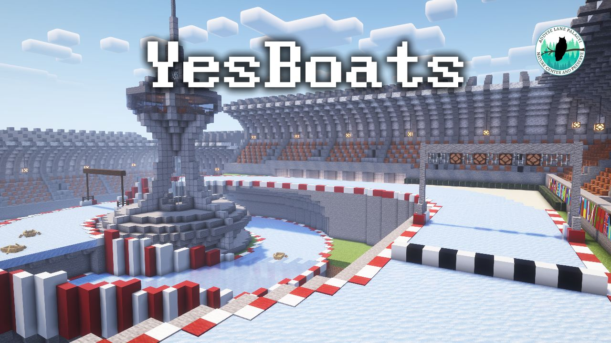
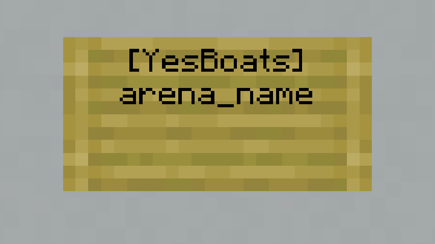
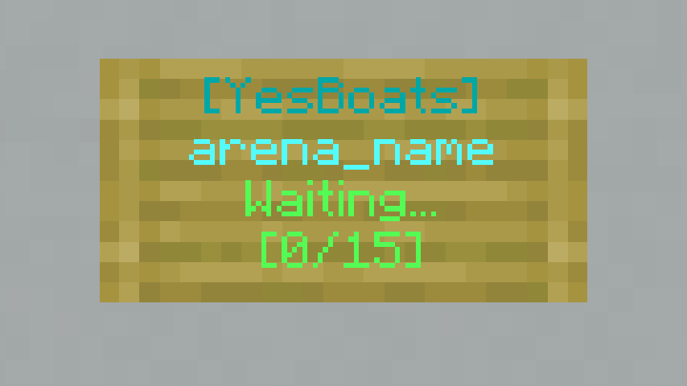

# YesBoats

YesBoats is an ice boat racing plugin for Minecraft servers running Spigot/Paper. It comes with a lap counter, timer, checkpoints, a death/respawn system, and a fully-fledged arena editor for easy setup. 

(Racetrack not included)

## Installation

Download the plugin jar file from the [latest release](https://github.com/LearnerCouncil/YesBoats/releases/latest) and add it to your server's plugin folder.

> [!warning]
> Prior versions of YesBoats and/or Minecraft are **not** supported.
## Usage

(All commands starting with `/yesboats` can be abbreviated to `/yb`.)
(For more information, you can run `/yesboats help` at any time.)
### Arena Setup
> [!note]
> The following section requires operator status, or the `yesboats.commands.yesboats.admin` permission.

To add an arena, use `/yesboats add <name>`, where `<name>` is the arena's name. This will register the arena and bring you into the editor. To access this editor later, use `/yesboats edit <name>`.  
Once you are in the editor, the following items will be added to your inventory. These items are used to configure the arena. (You can hover over an item in your inventory to see what it does):
- **Regenerate** - Use this to regenerate your inventory if you accidentally lose an editor item.
- **Area Selector** - Left-click a block to set one corner, and right-click to set the other corner. This will create a blank bounding box (denoted by *white* particles) which you can then turn into a **Checkpoint** or a **Death Barrier**. Looking at a bounding box will "select" it (denoted by *yellow* particles). You can drop the **Area Selector** to delete the selected bounding box.
- **Death Barrier** - Click a selected bounding box with this to turn it into a Death Barrier (denoted by *red* particles). If a player enters a death barrier, they will be teleported back to the spawn location of their last **Checkpoint**.
- **Checkpoint** - Click a selected bounding box with this to turn it into a Checkpoint (denoted by *blue* particles). The first checkpoint created will act as the start/finish line, and players will have to pass all the checkpoints in the correct order for the lap to count. After creating a checkpoint, you will be prompted to click again to set the checkpoint's spawn location. This will set the checkpoint's spawn location to the location you are standing. (Note: The spawn location doesn't necessarily need to be within the checkpoint's bounding box. This, combined with **Death Barriers**, can be used to create intentional teleports, which are useful when adding verticality to your race tracks.)
- **Add Start Location** - Place this boat to add a start location. These will determine where each player spawns when they first join the arena. The number of Start Locations will determine the maximum capacity of the arena.
- **Set Lobby Location** - Click with this to set the lobby location to where you are standing. This is the location players will be teleported to once the game is over.
- **Start Line Activator** - Click on a Redstone Block with this to set it as the Start Line Activator. This should be hooked up to a pre-existing barrier (such as pistons) placed in front of the players. This will then get cleared at the end of the countdown to allow the players to start the race.
- **Add Light Location** - Click on a block with this to add it as a Starting Light. These lights will turn on one by one at the start of the race, acting as the countdown. The more lights you have, the longer the countdown will be. (Note: Lights will not work properly if placed directly adjacent to each other. Please ensure the lights have at least one block of space between them.)
- **Minimum Players** - Left-click to increase, right-click to decrease. This is the minimum amount of players required for the arena to start (indicated by the count of the item). (Note: This cannot be increased past the number of **Start Locations**.)
- **Laps** - Left-click to increase, right-click to decrease. This is the amount of laps each player must complete to finish the race.
- **Time** - Left-click to increase by 30s, right-click to decrease by 30s. This is the amount of time before the race ends. This is implemented so that slow or AFK players don't make the race last indefinitely.
- **Debug** - Toggles extra internal debugging capabilities. You shouldn't need to touch this.
- **Save** - Exits the editor, saving all changes made. (Note: The arena must be valid for this to work, if some things are invalid or unset, this will throw an error.)
- **Cancel** - Exits the editor, discarding all changes made.

### Join Signs
> [!note]
> The following section requires operator status, or the `yesboats.joinsign` permission.

Join signs can be created by placing a sign with the text detailed in the below diagram, replacing 'arena_name' with the name of the arena you want the sign to lead to. Once a join sign is placed, it will be styled accordingly, and keep track of the number of players in the arena, and the arena's current state.
#### Before:
</img>
#### After:
</img>

### Playing
> [!note]
> The following section requires operator status, or the `yesboats.commands.yesboats.user` permission.

If everything is set up correctly, you can join an arena by clicking a Join Sign or doing `/yesboats join <arena>`, where `<arena>` is the arena's name. This will bring you into the arena and place you in a boat at the first available Start Location. During this time, you can click the boat items in your inventory to change the wood type of your boat. 

After the Minimum Players threshold is reached, the queue timer will begin. This will count down from 30 seconds (configurable in `config.yml`) to allow time for additional players to join. After the queue time is over, the players will be released and the countdown will begin. Once the countdown is up the Start Line Activator is removed, lowering the barrier and allowing the players to start.

Once a player finishes the race, they will be told their final time, their position in the race will be announced, and they will become a "spectator"; able to fly around and watch the other players. Once all players have finished, the game will end, and all players will be teleported to the arena's Lobby Location.

Additionally, any player can leave the game at any time by doing `/yesboats leave`.

### PlaceholderAPI

This plugin is also compatible with PlaceholderAPI, allowing access to certain aspects of an arena through placeholders.  
The placeholders, and what they resolve to, are as follows (replacing `<arena>` with the name of your arena):

- `%yesboats_<arena>_name%` - The name of the arena.
- `%yesboats_<arena>_status%` - The status of the arena. (One of 'Waiting...', 'Starting...', or 'Running...')
- `%yesboats_<arena>_players%` - The amount of players currently in the arena.
- `%yesboats_<arena>_minplayers%` - The minimum amount of players required for the arena to start.
- `%yesboats_<arena>_maxplayers%` - The maximum amount of players that can fit in the arena.

Further information on how to use placeholders can be found on
the [PlaceholderAPI Wiki](https://wiki.placeholderapi.com/).
